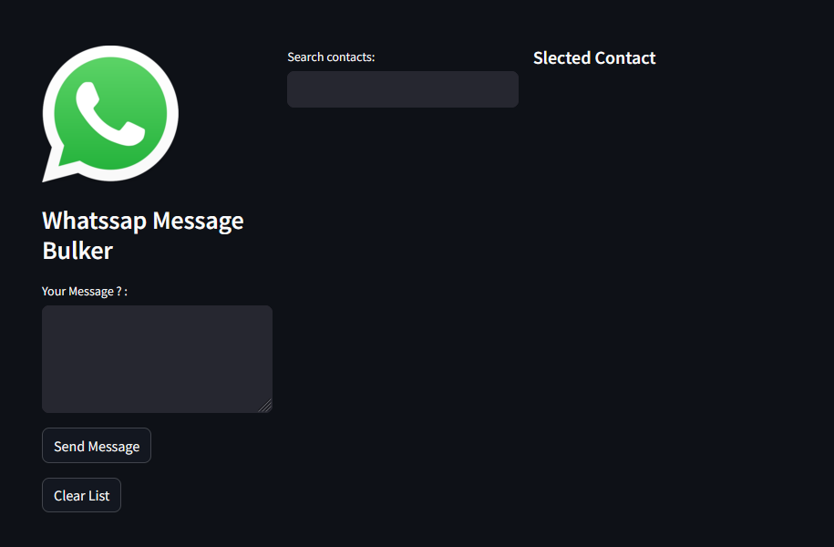

## WhatsApp Bulk Message using Streamlit and Selenium
This repository contains a Streamlit web application designed to facilitate sending messages to multiple WhatsApp contacts simultaneously. Powered by Streamlit and Selenium, this tool offers a user-friendly interface for efficiently broadcasting messages to targeted groups on WhatsApp.

### Getting Started
To successfully start the project, follow these steps:

#### 1. Export All Phone Contacts to Contact.vcf File
Export all your phone contacts to a .vcf (vCard) file. This file will contain the contacts you wish to send messages to.

#### 2. Replace the File in the Project with the Exported File
Replace the Contact.vcf file in the project directory with the exported .vcf file containing your contacts.

#### 3. Install Necessary Libraries
Ensure you have Python 3.12 installed. Then, install the necessary libraries using pip:

```bash
pip install streamlit selenium
```
Usage
Once you have completed the setup steps, you can run the Streamlit app locally:

```bash
streamlit run Run.py
```
Access the Streamlit app through your web browser, and follow the on-screen instructions to send bulk messages via WhatsApp.


##### Remarque : 
This project was developed in Python 3.12. You can contribute to this project by forking the repository, making your changes, and creating a pull request.
